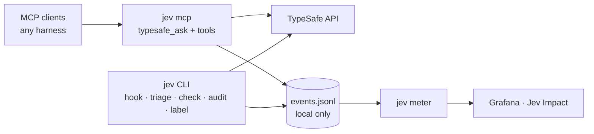

# jev-toolkit

MCP-first toolkit for [TypeSafe/Jev](https://docs.typesafe.ai) — the System
One decision model. One stdio server (`jev mcp`) serves any MCP-capable
harness, backed by one local event log and Prometheus impact metrics on the
existing Grafana stack.

Built as an **Effect** codebase (v4 RC): services with Layers, typed errors,
Schema-validated boundaries, no runtime dependencies besides `effect`.



## Features

**Judgment surface** — `typesafe_ask` (MCP, `jev mcp`) with `choice`, `noul`,
and `score` primitives, next to task-shaped tools that wrap the question packs:
`typesafe_verify` (claims against evidence) and `typesafe_review` (quality
dimensions with direct before/after directions). `jev ask` is the same judgment
over stdin for harnesses without MCP. Details in [docs/mcp.md](docs/mcp.md).

**Pack lab** — `jev eval pack` replays labeled fixtures through a pack,
repeating identical calls to expose answer drift and reporting agreement,
confidence, tokens, and latency before thresholds are trusted.

**Deterministic triggers** — `jev hook prompt` prints the Jev directive when
the latest prompt matches local claim patterns, and `jev triage failure`
classifies failures with the loop breaker built in. The live trigger is a local
regex; the audit's detection is model-first. Details in
[docs/cli.md](docs/cli.md).

**Triage packs** — reviewer findings (class · severity · evidence → blockers /
cosmetic / questions, with an evidence floor), harness and CI failures
(classification plus a semantic loop breaker), commit conformance (code checks
plus Jev rules, with repo spec profiles via `--spec`), session labels (outcome,
friction, waste, task type), and claim detection/alignment (batched per
message, batched per session).

**Audit and measurement** — `jev audit run` detects quantitative claims agents
actually made and scores compliance; `jev audit prompts` measures the live
trigger against real user prompts. Both are model-first: prose-only state
(fenced code stripped, credentials redacted, clipped), batched calls, code
applies only documented thresholds. Details in [docs/cli.md](docs/cli.md).

**Impact metrics** — every call, opportunity, triage, and label lands in one
local JSONL event log; `jev meter serve` exposes Prometheus series scraped by
`~/work/claude-code-metrics` and rendered as the `Jev Impact` dashboard at
<http://localhost:3000/d/jev-impact>. Details in [docs/metrics.md](docs/metrics.md).

## Quick start

```console
scripts/install.sh        # link ~/.local/bin/jev -> bin/jev (Node >= 26)
export TYPESAFE_API_KEY=… # must be visible to harness processes

jev ask </path/to/payload.json        # raw judgment over stdin
jev triage failure --transcript FILE  # failure classification + loop breaker
jev audit run --since 24h --dry-run   # what claims did agents make?
jev meter serve                       # Prometheus on 127.0.0.1:8788
```

Wire your harness: [docs/mcp.md](docs/mcp.md) — any stdio MCP client, `command:
jev`, `args: ["mcp"]`.

### CLI at a glance

| Command              | Purpose                                                                                |
| -------------------- | -------------------------------------------------------------------------------------- |
| `jev ask`            | Raw judgment: `{state, questions, model?}` on stdin                                    |
| `jev triage failure` | Classify a failure; transcript mode selects the failing snippet; loop breaker built in |
| `jev triage review`  | Route findings: blockers / cosmetic / questions                                        |
| `jev check commit`   | Commit conformance; `--spec` adopts the repo's documented rules; `--replay N`          |
| `jev audit run`      | Detect claims agents made; compliance summary; `--dry-run`                             |
| `jev audit prompts`  | Measure the live prompt trigger against real prompts                                   |
| `jev label sessions` | Outcome, friction, and waste labels per session                                        |
| `jev eval pack`      | Replay labeled fixtures through a pack; agreement, drift, tokens, and latency          |
| `jev events`         | Tail the local event log                                                               |
| `jev hook prompt`    | Harness hook adapter (prints the directive or nothing)                                 |
| `jev mcp`            | MCP server: `typesafe_ask` plus task-shaped judgment tools                             |
| `jev meter serve`    | Prometheus metrics from the event log                                                  |

## Docs

| Page                                    | Covers                                                                                                           |
| --------------------------------------- | ---------------------------------------------------------------------------------------------------------------- |
| [architecture.md](docs/architecture.md) | System map, call lifecycle, services, event schema, audit pipeline, loop breaker, privacy boundary, design rules |
| [cli.md](docs/cli.md)                   | Every command with flags, examples, outputs, exit codes, and flow diagrams                                       |
| [mcp.md](docs/mcp.md)                   | `typesafe_ask` protocol surface, tool schema, error contract, request lifecycle                                  |
| [metrics.md](docs/metrics.md)           | Metric catalogue, dashboard, launchd meter, smoke test                                                           |

## Layout

```
src/core/           services + schema (client, events, metrics, loops, text, transcript, paths)
src/mcp/server.ts   stdio MCP server (jev mcp) — the judgment tool surface
src/cli/jev.ts      CLI: ask | events | audit | label | check | triage | hook | mcp | meter
src/question-packs/ detection, alignment, reviewer, failure, commit, session labels
src/eval/          pack lab: fixture replay, answer drift, and agreement reports
src/audit/          message extractors (opencode2 DB, claude projects, pi/omp logs)
src/replay/         review-fixture capture/score measurement aid
tests/              offline tests + fixtures (fake transports, temp dirs)
dashboards/         Jev Impact Grafana dashboard + install script
launchd/            always-on meter plist
scripts/            install.sh · install-dashboard.sh · check-metrics.sh
tools/oxlint/       vendored anti-slop rule groups
docs/               this documentation set
```

## Tooling

`oxlint` (vendored anti-slop generic + Effect rules), `oxfmt`, `tsc`,
`vitest`. All four gates run before every commit:

```console
npm run lint && npm run format:check && npm run typecheck && npm test
```

Tests are offline by design: fake transports, temp dirs, `127.0.0.1` only, no
module mocking.

An end-to-end smoke test (live TypeSafe API plus a real opencode2 session) is
operator-run and never part of `npm test`:

```console
scripts/smoke-opencode2.sh            # agent session + operator checks
scripts/smoke-opencode2.sh --no-agent # operator checks only
```

## Privacy

Automated flows (`audit`, `label`, `triage`, `check`, hooks) sanitize before
anything leaves the machine: credentials are masked, fenced code blocks become
`[code]`, and long text is clipped with a marker. `TYPESAFE_API_KEY` is read at
call time and never logged. Raw code, diffs, transcripts, secrets, and
credentials never go into the event log; the log is local-only.

`jev ask` and the MCP `typesafe_ask` tool accept caller-provided state and send
it as provided — callers are responsible for redaction there. Details in
[architecture.md](docs/architecture.md#privacy-boundary).
