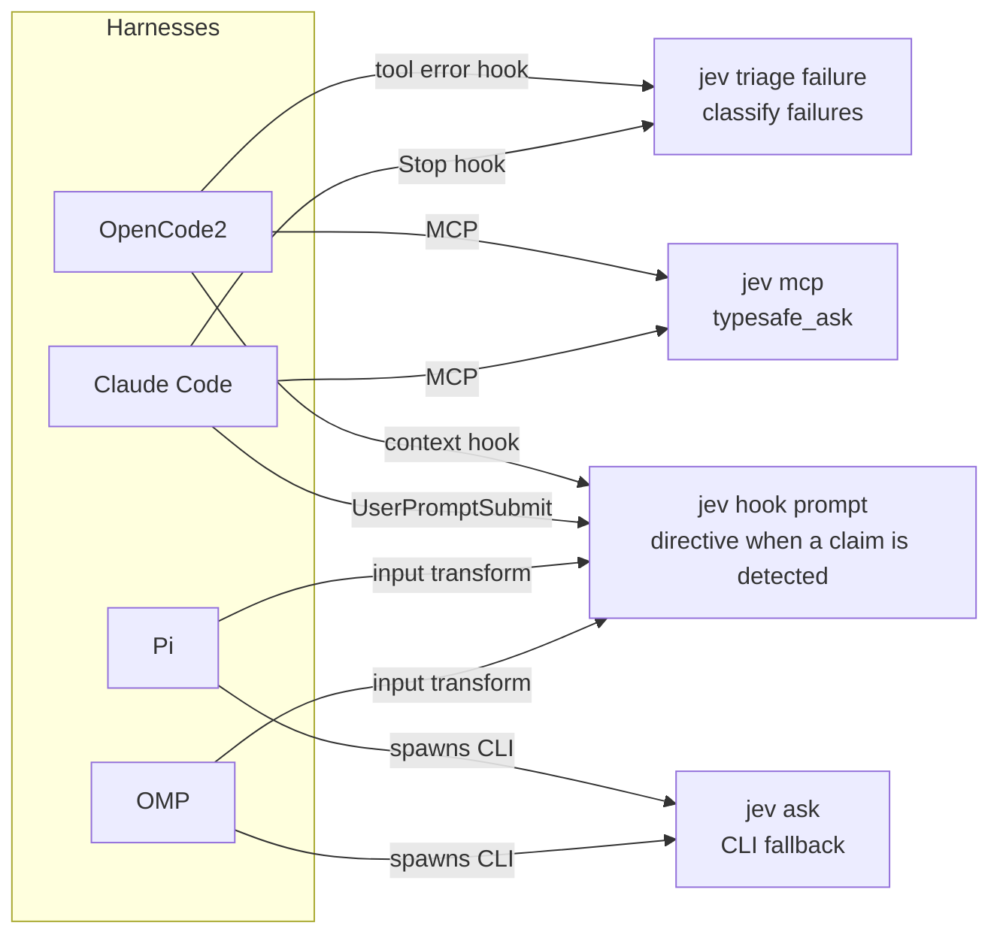

# Agent integration guide

How jev-toolkit wires Jev/TypeSafe into OpenCode2, Claude Code, Pi, and OMP —
what each harness gets, how to install it, and what to check when it breaks.

- Event schema and core design: [architecture.md](architecture.md)
- Every CLI command: [cli.md](cli.md)
- MCP protocol details: [mcp.md](mcp.md)
- Metrics and dashboards: [metrics.md](metrics.md)

## Integration model

The `typesafe_ask` tool lives once, in `jev mcp`. Native integrations add only
what MCP cannot: deterministic triggers.



| Harness | Judgment | Prompt trigger | Failure trigger |
|---|---|---|---|
| OpenCode2 | MCP | plugin context hook | plugin tool hook |
| Claude Code | MCP | `UserPromptSubmit` hook | `Stop` hook |
| Pi | extension tool → `jev ask` | input transform | — |
| OMP | same extension | input transform | — |

All harness paths require `jev` on `PATH`:

```console
~/personal/jev-toolkit/scripts/install.sh   # links ~/.local/bin/jev → bin/jev
```

`TYPESAFE_API_KEY` must be visible to the harness process. A missing key is
reported as a config error; no judgment is ever invented.

## OpenCode2

**MCP tool** — add to the global `opencode.json(c)`:

```jsonc
{
  "mcp": {
    "servers": {
      "jev": {
        "type": "local",
        "command": ["jev", "mcp"],
        "environment": { "JEV_HARNESS": "opencode2" }
      }
    }
  }
}
```

**Trigger plugin** — the V2 plugin API is unstable (written against
`@opencode/plugin` 2.0.2); check the V2 plugins guide if it stops loading.

1. Install the plugin dependency once (network needed):
   `cd src/integrations/opencode2 && bun install`
2. Link the plugin: `~/.config/opencode/plugins/typesafe` →
   `src/integrations/opencode2` (see the full README in that directory).

The plugin's `context` hook runs before every model call: it re-checks the
latest user message through `jev hook prompt`, appends the directive when the
local claim patterns match, and keeps the policy line in the system parts.
Tool errors spawn `jev triage failure` best-effort. The V2 beta
(`0.0.0-beta-18269`) accepts a `prompt` hook registration but never dispatches
it (verified 2026-09-17 with a minimal probe plugin), so OpenCode2 does not
register one. The same hook injects the session id and instructs the model to
pass it as `sessionID` to `typesafe_ask`; without that id the audit cannot
attribute calls to sessions and compliance/coverage stay 0.

After plugin edits: `opencode2 service restart` — a stale `(failed)` plugin
entry clears on restart.

## Claude Code

```console
claude plugin marketplace add ~/personal/jev-toolkit
claude plugin install jev-toolkit@jev-toolkit
claude plugin list
```

The plugin ships:

- `mcpServers.jev` → `jev mcp` with `JEV_HARNESS=claude-code`
- `UserPromptSubmit` → `jev hook prompt` (prints the directive or nothing;
  never blocks, 10s timeout)
- `Stop` → `jev triage failure --transcript $transcript_path`, filtered to
  print only when `blocks_work ≥ 0.7` or the loop breaker escalates (60s
  timeout)
- `skills/jev/SKILL.md` — when and how to call `typesafe_ask`

Reinstall after manifest changes (the plugin cache copies files at install
time) and restart Claude Code.

## Pi

```console
ln -sfn ~/personal/jev-toolkit/src/integrations/pi ~/.pi/agent/extensions/jev
```

Self-contained extension: `typesafe_ask` delegates to `jev ask`, the input
transform delegates to `jev hook prompt`. No `effect` import, no repo-relative
imports, nothing to install (`typebox` comes from Pi's shared extensions).
Events carry `harness: "pi"`.

## OMP

```console
omp plugin install ~/personal/jev-toolkit
omp plugin doctor
```

OMP vendors the Pi extension API, so this package re-exports the Pi
extension; one registration serves both. `omp plugin doctor` must report a
`pi` manifest and no load errors. Events carry `harness: "omp"`.

## Git commit hook

`src/integrations/git-hooks/commit-msg` runs `jev check commit` on every
commit. Warn-only by default; `JEV_COMMIT_GATE=block` mirrors the verdict exit
code. Install by copying/symlinking into `.git/hooks/` or via
`core.hooksPath`.

## Trigger reference

- The live trigger is the local regex (`core/detector.ts`): percent,
  probability, ranking, estimate, and choice patterns. It only decides whether
  to append the directive — a harmless nudge, not a gate.
- The audit's claim detection is model-first (`claim-detection` pack); the
  regex only quotes spans there. To check whether the live trigger is missing
  real prompts, run `jev audit prompts --since 7d`.
- The directive text lives in `core/directives.ts` and is shared by every
  harness; the context policy line is injected by the MCP `initialize`
  instructions and the OpenCode2 context hook.

## Troubleshooting

| Symptom | Check |
|---|---|
| MCP tool missing (OpenCode2) | `opencode2 plugin list`; a `(failed)` entry clears on `opencode2 service restart` |
| MCP tool missing (Claude) | `claude plugin list`; reinstall the plugin after manifest changes, then restart |
| No events | `jev events --n 20`; the log honors `JEV_DATA_DIR` |
| Config error from a tool | `TYPESAFE_API_KEY` not visible to the harness process |
| Pi/OMP extension fails to load | jiti resolves relative paths lexically; keep extensions self-contained and never `npm install` inside integration folders |
| Commit hook silent | `command -v jev` fails in the hook's environment, or the message passed the check |
| Dashboard stale/empty | restart the meter after meter-code edits; see [metrics.md](metrics.md) |

## Policy: log-first

Triggers observe and record before they gate. The only suppression paths are
the loop breaker (fires once at the third identical failure) and any future
secret trap; both are covered by fixtures. Never send secrets, credentials, or
raw proprietary code in `state` — sanitized summaries and counts only.
