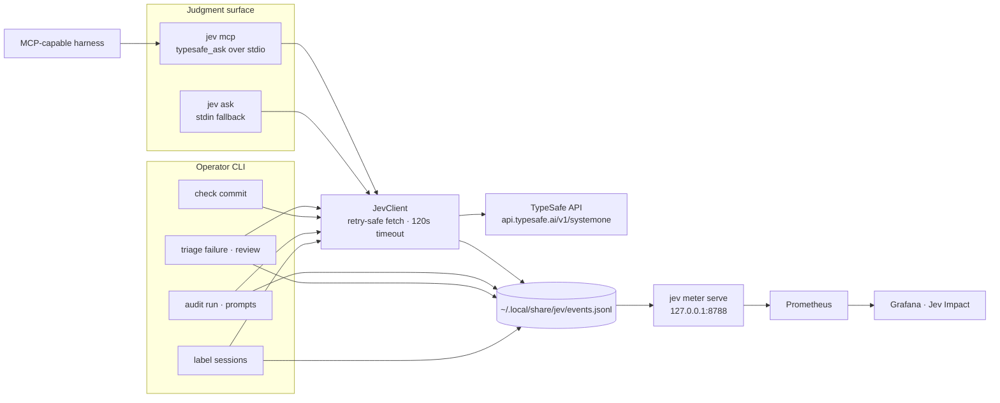
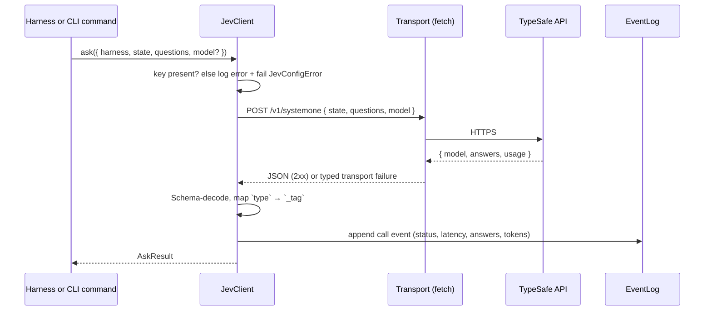
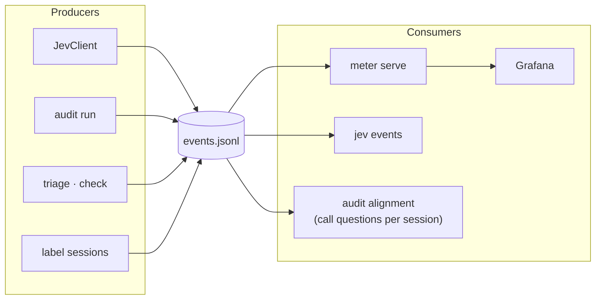
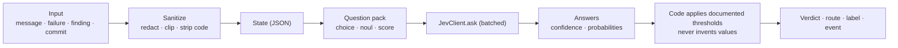
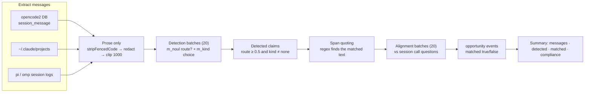
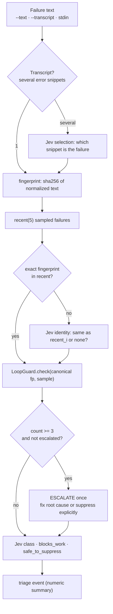
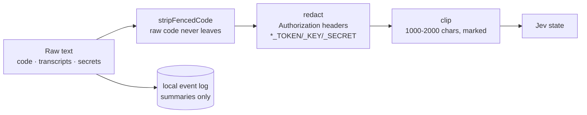

# Architecture

How the pieces fit together: one judgment client, one MCP surface, one event
log, and a meter that turns the log into Prometheus series.

## System map

Two rules keep this small:

1. **Judgment lives once.** Every MCP-capable harness connects to the same
   `jev mcp` server; `typesafe_ask` is the generic surface and task-shaped
   tools wrap question packs instead of reimplementing them (see
   [mcp.md](mcp.md#tool-surface-policy)). Local CLI commands are the other
   callers.
2. **Every judgment is logged.** The client appends to the event log before the
   answer is returned to the caller; a logging failure never fails the call.

## Call lifecycle

Error taxonomy (`src/core/client.ts`): `JevConfigError` (no API key),
`JevTransportError` (network), `JevTimeoutError` (120s), `JevApiError`
(non-2xx, carries status), `JevDecodeError` (shape mismatch). Callers surface
these as text, never guesses.

## Core services

| Module | Service | Responsibility |
|---|---|---|
| `core/client.ts` | `JevClient` | Ask TypeSafe, map wire format (`type`) to the internal dialect (`_tag`), log every call |
| `core/events.ts` | `EventLog` | Append/read the JSONL log; malformed lines are skipped |
| `core/metrics.ts` | `serveMeter` | Read the log, render Prometheus text on `127.0.0.1:8788` |
| `core/loops.ts` | `LoopGuard` | Fingerprint failures, count repeats, prune after 24h, escalate once at the third |
| `core/detector.ts` | — | Deterministic claim patterns: live trigger + span quoting for detected claims |
| `core/text.ts` | — | `redact` (credentials), `clip`, `stripFencedCode` (prose-only state) |
| `core/transcript.ts` | — | Claude transcript parsing: `is_error` tool results, newest first |
| `core/directives.ts` | — | The prompt directive and context policy strings shared by every harness |
| `core/paths.ts` | — | Data dir, event log, loop state, harness session roots, API endpoint |

All services follow the repo conventions: class-style `Context.Service`,
`make*` constructors plus Layer factories, `Data.TaggedError` failures, and
`Effect.runPromise` only at host entrypoints (CLI `main`, MCP boundary, tests).

## Event log

One JSONL file (`JEV_DATA_DIR`, default `~/.local/share/jev`). Five kinds,
all validated by `src/core/schema.ts`:

| Kind | Fields (abridged) | Written by |
|---|---|---|
| `call` | harness, sessionID, model, latencyMs, status, questions (id+type), answers, tokens, error? | JevClient on every ask |
| `opportunity` | harness, sessionID, source, pattern, matched | `audit run` |
| `triage` | harness, feature (failure/review/commit/verify), numeric summary | triage commands, `typesafe_verify` |
| `session_label` | harness, sessionID, outcome, friction, waste, taskType | `label sessions` |
| `review` | harness, sessionID, model, dimensions (normalized score, confidence, applicable, direction?), topWeakness? | `typesafe_review` |

Event content is summaries, counts, and answers only. Raw code, transcripts,
and secrets never enter the log, and `triage` events carry numeric summaries
only (`Schema.Record(Schema.String, Schema.Number)`).

## Judgment pattern: question pack → answers → code policy

Every feature follows the same shape:

The model judges; code composes. Thresholds (`>= 0.5`, `>= 0.6`, severity
`>= 3`) are explicit constants with comments — they are policy, not magic.

## Audit pipeline (`jev audit run`)

`jev audit prompts` reuses detection with the `user_prompt` subject to measure
the live trigger: how many prompts the local regex tags versus how many Jev
would route, with examples of both disagreements.

## Failure triage and the loop breaker

The loop breaker is the only suppression path in the system and it fires
exactly once per fingerprint (24h window). State lives in
`loop-state.json`, written atomically.

## Privacy boundary

- `TYPESAFE_API_KEY` is read at call time; never logged, never persisted.
- Automated flows (`audit`, `label`, `triage`, `check`, hooks) mask credentials
  (bare or quoted Authorization/API-key fields, `*_TOKEN`/`*_KEY`/`*_SECRET`/
  `*_PASSWORD` assignments, Bearer tokens) and replace fenced code blocks with
  `[code]` before state is sent.
- Direct callers (`jev ask`, MCP `typesafe_ask`) own their state; the client
  sends it as provided and does not redact for them.
- Triage events store counts, not text; `session_label` stores enum labels.
- Tests are offline: fake transports, temp dirs, `127.0.0.1` only, no module
  mocking.

## Design rules

- **Effect everywhere in core.** `Effect.Effect` returns, `Data.TaggedError`
  failures, services via `Context.Service` + Layers. Platform APIs (`fetch`,
  `node:fs`, `node:sqlite`) are wrapped at the boundary once.
- **Schema at every boundary.** JSONL lines, API responses, stdin payloads,
  transcripts, git output. Malformed input is skipped or failed explicitly.
- **Log-first.** New triggers observe and record before they gate; only the
  loop breaker (and future secret traps) may suppress, and only after their
  fixtures pass.
