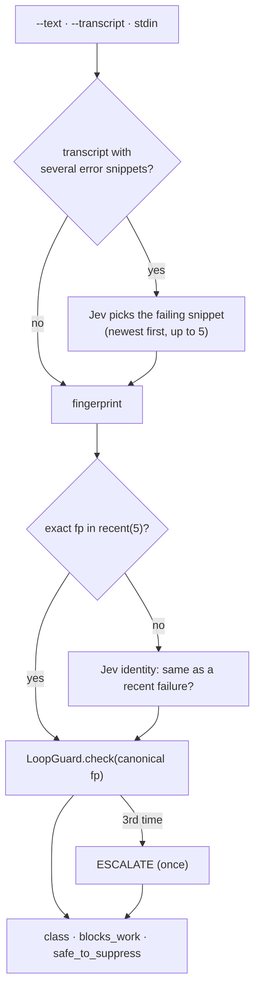
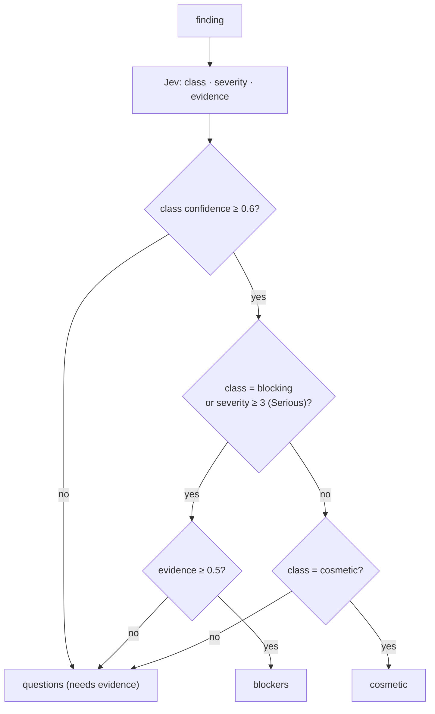
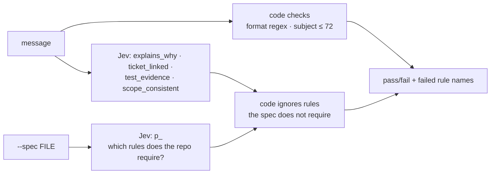

# CLI reference

`jev` is the operator surface: judgments, triage, audit, labeling, and the
meter. Every command that calls TypeSafe reads `TYPESAFE_API_KEY` at call time
and appends a `call` event to the local log.

```console
jev ask                                  # {state, questions, model?} JSON on stdin
jev events [--harness H] [--n 10]        # tail the local event log
jev triage failure --text FILE           # classify a failure; loop breaker built in
jev triage failure --transcript FILE     # pick the failing tool result, then classify
jev triage review --input findings.json  # route findings: blockers/cosmetic/questions
jev check commit --message-file FILE     # commit conformance (--spec, --replay built in)
jev label sessions --since 24h           # outcome / friction / waste per session
jev audit run --since 24h                # detect quantitative claims agents made
jev audit prompts --since 7d             # measure the live prompt trigger
jev hook prompt                          # harness hook: print the directive when applicable
jev eval pack --fixtures FILE            # replay labeled fixtures through a pack
jev mcp                                  # MCP server: ask + verify + review tools
jev meter serve [--port 8788]            # Prometheus metrics
```

## Conventions

| Item | Behavior |
|---|---|
| Harness tag | Commands default to `cli` (triage) or `script` (check, audit, label); override with `JEV_HARNESS` |
| Time windows | `--since` accepts `Nh` (hours) or `Nd` (days); defaults are per command |
| Invalid input | Decoded with Effect Schema; malformed payloads fail with a usage-style message and exit 1 |
| Exit codes | `0` success · `1` usage/input errors and failed commit verdicts · triage commands stay `0` after a successful classification |
| Output | Human-readable lines on stdout; errors on stderr; JSONL only from `jev events` |

Environment variables (see `core/paths.ts` and `core/client.ts`):

| Variable | Default | Purpose |
|---|---|---|
| `TYPESAFE_API_KEY` | — | Required for any call; missing key is a `JevConfigError`, never a guess |
| `JEV_ENDPOINT` | `https://api.typesafe.ai/v1/systemone` | API endpoint (tests use a local fake) |
| `JEV_DATA_DIR` | `~/.local/share/jev` | Event log + loop state |
| `JEV_HARNESS` | per-command default | Harness tag on events |
| `JEV_OPENCODE_DB` | `~/.local/share/opencode/opencode.db` | Audit/label source |
| `JEV_METER_PORT` | `8788` | Meter port |
| `JEV_METRICS_STACK` | `~/work/claude-code-metrics` | Dashboard install script |

## ask — raw judgment

Reads `{ state, questions, model? }` from stdin, prints formatted answers.
This is the fallback for harnesses without MCP and the debugging tool.

```console
$ echo '{"state":{"text":"Ship the parser refactor today?"},"questions":{
  "ship":{"_tag":"noul","instructions":"Should this ship today?"},
  "risk":{"_tag":"choice","instructions":"Risk level?","criteria":{"low":"safe","high":"risky"}}}}' | jev ask
jev jev-latest
ship: p(yes)=0.31 — likely no
risk: low (confidence 0.62)
usage: 118 in / 19 out
```

Question primitives: `choice` (criteria map), `noul` (probability of yes),
`score` (ordered criteria array). Answers carry `confidence` and, for choice,
full `probabilities`.

## triage failure — failure classification with a loop breaker

```console
jev triage failure --text FILE        # file, or --text - for stdin
jev triage failure --transcript FILE  # Claude Code transcript JSONL
```



Output lines: `failure class: <choice> (confidence N)`, `blocks_work:
p(yes)=N`, `safe_to_suppress: p(yes)=N`, and `ESCALATE: …` at the third
occurrence of the same fingerprint. Transcript mode passes only the selected
failure text to the classifier — not the whole transcript.

## triage review — route review findings

```console
jev triage review --input findings.json
```

Input: `{ "meta"?: {...}, "findings": [{ "id", "title", "detail", "file?", "line?" }] }`
(details are redacted and clipped before leaving the machine).



Two review-level gates are answered in the same call: `review_substantive`
(did the review examine the diff) and `truncated` (did it stop mid-verdict).
A `triage` event with counts is appended.

## check commit — commit conformance

```console
jev check commit --message-file FILE [--spec FILE]
jev check commit --replay 10 [--repo DIR] [--spec FILE]
```



Without `--spec`, all four semantic rules apply. With `--spec`, the same call
also answers `p_<rule>` profile questions and the verdict only enforces the
rules the documented spec imposes. Exit code `0` for pass, `1` for any failed
check. `--replay` runs the check over the last N commits of `--repo`.

Wire it into a `commit-msg` hook and mirror the exit code to gate commits;
ignoring the code keeps the hook warn-only.

## audit run — claim detection and compliance

```console
jev audit run [--since 24h] [--harness all|opencode|claude-code|pi|omp] [--dry-run]
```

Pipeline: extract assistant messages → prose-only state (fenced code stripped,
redacted, clipped) → batched detection (20 messages/call: a routing `noul` plus
a kind `choice` per message) → span quoting by the local regex → alignment
against the questions actually asked in that session → append `opportunity`
events. See [architecture.md](architecture.md#audit-pipeline-jev-audit-run).

```console
$ jev audit run --since 2h --dry-run
harness        messages detected matched missed compliance (dry run)
opencode      97       4         0       4      0.0%
total: messages=97 detected=4 matched=0 (detection rate 4.1%)
```

`--dry-run` prints the summary without appending events. Detection rate is
typically single-digit percent — most assistant messages are not claims.

## audit prompts — measure the live trigger

```console
jev audit prompts [--since 7d]
```

Runs the same detection with the `user_prompt` subject over real user prompts
and compares with what the local regex trigger would have tagged:

```console
$ jev audit prompts --since 7d
prompts=612 regex_tagged=31 jev_detected=3 missed_by_regex=3 regex_noise=31
missed by regex (examples): …
routed by Jev (examples): …
regex-tagged but not routed by Jev (examples): …
```

Use this to decide whether the live trigger needs to move off the local regex.

## label sessions — session outcome, friction, waste

```console
jev label sessions [--since 24h] [--harness …] [--limit 50] [--dry-run]
```

Builds one digest per session (captured user prompts clipped to 300 chars,
assistant turns, tool counts, error count, optional cost), then asks per batch
of 10: outcome (`shipped`/`blocked`/`abandoned`/`ongoing`), friction score
(`None`…`Severe`), dominant waste (`none`/`loop`/`truncation`/`retries`/
`waiting_on_human`), plus one batch-level task type (`feature`, `fix`,
`review`, `analysis`, `release`, `content`, `other`). Appends `session_label`
events. `--dry-run` prints the digests as JSON without calling Jev.

## eval pack — replay labeled fixtures

```console
jev eval pack --fixtures FILE [--repeat N] [--model MODEL] [--json]
```

Fixtures are one JSON file:

```jsonc
{
  "pack": "reviewer | commit | profile",
  "cases": [{ "id": "r1", "input": { /* … */ }, "expected": { "blockers": 1 } }]
}
```

`input` matches the pack's shape: reviewer findings
(`{ meta?, findings: [{ id, title, detail }] }`), a commit
(`{ message, spec? }`), or a review profile state
(`{ task?, diff?, files?, repositoryContext? }`). `expected` is optional; when
present, every numeric key is compared exactly against the run summary and the
report counts agreement.

The report lists per case: the summary, agreement, mean confidence, the largest
score spread across repeats, unstable answer ids, tokens, and latency; then
totals. `--repeat N` (max 10) runs each case N times with identical input so
drift is visible before thresholds are trusted; `--model` pins a version for
comparison; `--json` prints the report as JSON. Each run's Jev calls also append
`call` events to the local log.

## events — inspect the log

```console
jev events [--harness H] [--n 10]
```

Prints the last `--n` events (default 10) as JSONL. The log is a single file;
see [architecture.md](architecture.md#event-log) for the schema.

## hook prompt — harness hook adapter

Reads the harness hook payload (`{ "prompt": "…" }`) on stdin and prints
`PROMPT_DIRECTIVE` when the local trigger matches, nothing otherwise. Always
exits `0` and never blocks a prompt. Available for any harness with a prompt
hook.

```console
jev hook prompt [--verify]   # or JEV_HOOK_VERIFY=1
```

The local regex is a recall-oriented prefilter (see `jev audit prompts` for
its noise rate). With `--verify`, a regex hit is confirmed through Jev — the
SDK-backed client asks the `user_prompt` claim-detection question over the
sanitized prompt and prints the directive only when Jev routes it (noul ≥
0.5). When Jev is unreachable the hook fails open (prints the directive) so a
single outage never suppresses routing; the call is logged either way.

## mcp — the judgment surface

```console
jev mcp   # stdio JSON-RPC 2.0: typesafe_ask, typesafe_verify, typesafe_review
```

See [mcp.md](mcp.md) for the protocol, tool schemas, and error contract.

## meter serve — Prometheus metrics

```console
jev meter serve [--port 8788]
```

Serves `jev_*` series on `127.0.0.1` by reading the event log. See
[metrics.md](metrics.md) for the catalogue, dashboard, and launchd setup.
