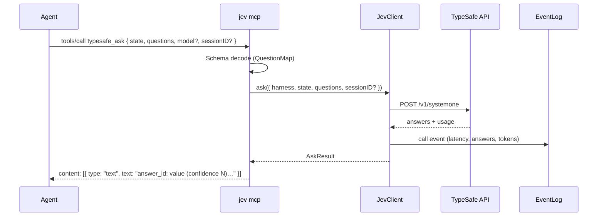

# MCP server (`jev mcp`)

One stdio server. `typesafe_ask` is the generic judgment tool, and task-shaped
tools may wrap the question packs under the tool-surface policy below. Every
MCP-capable harness connects to the same process.

The server mirrors the shapes of `~/personal/leadline/src/mcp.rs`:
version-echoing `initialize` (with an `instructions` field hosts inject),
strict `tools/call` validation, and text-content results. stdout carries only
JSON-RPC lines.

## Talk to it

```jsonc
// Standard stdio server declaration; exact shape varies per client
{
  "mcpServers": {
    "jev": {
      "command": "jev",
      "args": ["mcp"],
      "env": { "JEV_HARNESS": "your-harness" }
    }
  }
}
```

Any stdio MCP client works: `command: jev`, `args: ["mcp"]`. Set
`JEV_HARNESS` so `call` events carry the right harness tag.

## Protocol surface

| Method | Behavior |
|---|---|
| `initialize` | Echoes the client's `protocolVersion` (default `2024-11-05`), returns `capabilities.tools` and `instructions` = context policy + tool names |
| `ping` | Empty result |
| `tools/list` | The available judgment tools with their input schemas and annotations (`readOnlyHint: true`) |
| `tools/call` | Validates `{ name, arguments }`, executes the named tool, returns text content |
| `initialized`, `notifications/*` | Acknowledged, no response |

Errors: `-32700` parse, `-32600` invalid request, `-32601` unknown method,
`-32602` invalid params or unknown tool. Tool execution failures are **not**
JSON-RPC errors — they return `content` with `isError: true`, so the agent sees
a readable message instead of a protocol fault.

## Request lifecycle



## typesafe_ask

| Field | Type | Notes |
|---|---|---|
| `state` | string · object · array | The content to judge. Redact secrets, strip raw code — state leaves the machine |
| `questions` | object | Map of question id → question, internal dialect (`_tag`) |
| `model` | string? | TypeSafe model; default `jev-latest` |
| `sessionID` | string? | Harness session id; pass the exact value the harness provides so the call is attributable and auditable. Never invent one |

Question shapes:

```jsonc
{ "_tag": "choice", "instructions": "…", "criteria": { "opt": "description" } }
{ "_tag": "noul",   "instructions": "…", "criteria": { "true": "…", "false": "…" } } // criteria optional
{ "_tag": "score",  "instructions": "…", "criteria": ["level", "level", "…"] }
```

Answers:

```jsonc
choice → { "_tag": "choice", "choice": "opt", "confidence": 0.82, "probabilities": {…} }
noul   → { "_tag": "noul", "noul": 0.31 }
score  → { "_tag": "score", "score": 2, "confidence": 0.7, "probabilities": {…} }
```

Text results are one line per answer with plain verdict words, prefixed with
the model and suffixed with token usage — enough for an agent to read
directly, and echoed by `jev ask`. Noul lines read
`id: p(yes)=0.73 — likely yes` (bands: very likely yes / likely yes /
toss-up / likely no / very likely no). Score lines resolve the weighted index
against the question's ordered levels when known
(`id: 0.42 → between misleading and thin, leans misleading (confidence 0.58)`).
Choice and score lines append `— LOW, treat as no signal` when confidence is
below 0.4.

## typesafe_verify

Checks claims against evidence before they are published. Code extracts the
numbers a claim asserts and reports which ones the evidence does not contain;
Jev judges each remaining claim and returns one verdict line per claim:

```jsonc
{
  "claims": [{ "id": "c0", "text": "all 12 tests pass" }],
  "evidence": "test run: 12 passed, 0 failed",
  "sessionID": "…" // optional
}
```

```text
c0: supported (confidence 0.94)
```

Verdicts are `supported`, `contradicted`, `unrelated`, or `insufficient`;
`[numbers not in evidence: …]` marks deterministic gaps and `[needs evidence]`
marks verdicts below the confidence floor (`VERDICT_CONFIDENCE_FLOOR = 0.6`) or
claims whose numbers the evidence lacks. Claims and evidence are redacted before
the call, evidence is capped at 40,000 characters, and one `triage` event with
counts (`feature: "verify"`) is appended. The evidence text itself is never
logged. At most 20 claims per call.

## typesafe_review

Reviews a change across eight independent quality dimensions: correctness,
cognitive complexity, readability, modularity, coupling, changeability, test
quality, and security.

```jsonc
{
  "task": "add parser error recovery",
  "diff": "…",
  "files": [{ "path": "src/parser.ts", "content": "…" }], // optional, at most 8
  "repositoryContext": "…", // optional
  "previousEvaluation": { "dimensions": [ /* an earlier result */ ] }, // optional
  "sessionID": "…" // optional
}
```

At least one of `task`, `diff`, `files`, or `repositoryContext` is required.
Each dimension gets an applicability gate (`noul`), a score over five
dimension-specific descriptive levels, and — when `previousEvaluation` is
supplied — a direct `improved`/`unchanged`/`regressed`/`incomparable` judgment.
One review-level `choice` names the weakest dimension. There is no blended
overall score.

The result is JSON with raw scores (`0`–`4`), confidence, directions, the top
weakness, and token usage. Dimension scores are normalized to `0`–`1` for the
`review` event and the meter; the diff, files, and context are never logged.
Review state is caller-supplied code: fields are credential-redacted and
clipped, and state above 90,000 characters is rejected so the caller splits the
review.

## typesafe_skill_route

Routes a task to one skill from a caller-supplied catalog. The caller owns the
catalog: Jev cannot pick a candidate that was omitted, so pass every skill that
could apply.

```json
{
  "task": "the export button spins forever; find out why and fix it",
  "skills": [
    { "name": "debugging", "description": "Systematic root-cause work for failures" },
    { "name": "better-ui", "description": "UI polish: radius, spacing, hit areas" }
  ]
}
```

Each skill name is an option and each description is its criterion; `none` is
always offered. Three questions go out per call: the choice, a `noul` asking
whether a second skill helps, and a `score` for how much the task depends on the
skill. Code applies the floors (`SKILL_CONFIDENCE_FLOOR` 0.5,
`SKILL_DEPENDENCE_FLOOR` 2), so a low-confidence or low-dependence pick returns
`load: nothing` with the reason instead of a skill. Limits: 64 candidates, 4,000
task characters; the task is redacted and clipped, and only the outcome and the
skill name are logged.

## Tool-surface policy

`typesafe_ask` is the only tool an agent needs for an arbitrary judgment. New
tools are allowed when they are thin, task-shaped wrappers around a documented
question pack, and:

- the coding agent itself calls the tool in-flight — an operator CLI workflow
  or a harness hook is not a reason for a tool;
- the tool owns state assembly and the code thresholds for its policy, so
  callers do not hand-build state or re-implement routing;
- every call goes through the same `JevClient`, the same redaction rules, and
  the same event log as `typesafe_ask`;
- the name and description are distinct enough that an agent cannot confuse
  two tools; prefer extending an existing schema over near-duplicates.

Every judgment still starts as a question pack (`src/question-packs/`); tools
package packs, they do not replace them.

## Rationale and invariants

- **One schema, not one tool.** Agents learn one question dialect; new
  judgments become question packs, and a pack only becomes a tool under the
  tool-surface policy above.
- **Unknown tools are rejected**, never silently routed: `-32602`.
- **No secrets in state.** `typesafe_ask` sends caller-provided state as-is;
  `typesafe_verify` and `typesafe_review` redact credentials and clip their
  fields, and the CLI/hooks clip and redact by default.
- **Every call is logged** (harness, questions by id+type, answers, latency,
  tokens) to the local event log before the result returns. Verify results add
  a `triage` event with counts; review results add a `review` event with
  normalized dimension scores. Logging failures never fail the call.
- **Missing `TYPESAFE_API_KEY`** produces `isError: true` with a config
  message — never an invented number.

## Testing

`handleMcpRequest` is a pure function over `McpDeps.tools`, so tests drive the
full protocol without a network or an Effect runtime: initialize echo, tool
listing, argument validation, unknown method/tool, and result formatting are
covered in `tests/mcp/`. For end-to-end checks, point `JEV_ENDPOINT` at a
local fake transport.
