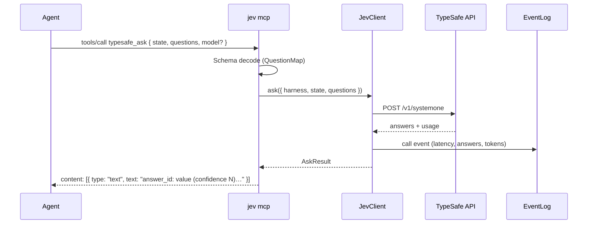

# MCP server (`jev mcp`)

One stdio server, one tool: `typesafe_ask`. Every MCP-capable harness connects
to the same process; native integrations only add triggers.

The server mirrors the shapes of `~/personal/leadline/src/mcp.rs`:
version-echoing `initialize` (with an `instructions` field hosts inject),
strict `tools/call` validation, and text-content results. stdout carries only
JSON-RPC lines.

## Talk to it

```jsonc
// opcode.jsonc — OpenCode2 (Claude Code declares the same server in its plugin)
{
  "mcp": {
    "servers": {
      "jev": {
        "type": "local",
        "command": ["jev", "mcp"],
        "environment": { "JEV_HARNESS": "opencode2" }
      }
    }
  }
}
```

Any stdio MCP client works: `command: jev`, `args: ["mcp"]`. Set
`JEV_HARNESS` so `call` events carry the right harness tag.

## Protocol surface

| Method | Behavior |
|---|---|
| `initialize` | Echoes the client's `protocolVersion` (default `2024-11-05`), returns `capabilities.tools` and `instructions` = context policy + tool name |
| `ping` | Empty result |
| `tools/list` | The single `typesafe_ask` tool with its input schema and annotations (`readOnlyHint: true`) |
| `tools/call` | Validates `{ name, arguments }`, executes the ask, returns text content |
| `initialized`, `notifications/*` | Acknowledged, no response |

Errors: `-32700` parse, `-32600` invalid request, `-32601` unknown method,
`-32602` invalid params or unknown tool. Tool execution failures are **not**
JSON-RPC errors — they return `content` with `isError: true`, so the agent sees
a readable message instead of a protocol fault.

## Request lifecycle



## Tool input

| Field | Type | Notes |
|---|---|---|
| `state` | string · object · array | The content to judge. Redact secrets, strip raw code — state leaves the machine |
| `questions` | object | Map of question id → question, internal dialect (`_tag`) |
| `model` | string? | TypeSafe model; default `jev-latest` |

Question shapes:

```jsonc
{ "_tag": "choice", "instructions": "…", "criteria": { "opt": "description" } }
{ "_tag": "noul",   "instructions": "…", "criteria": { "true": "…", "false": "…" } } // criteria optional
{ "_tag": "score",  "instructions": "…", "criteria": ["level", "level", "…"] }
```

Answers:

```jsonc
choice → { "_tag": "choice", "choice": "opt", "confidence": 0.82, "probabilities": {…} }
noul   → { "_tag": "noul", "noul": 0.31 }
score  → { "_tag": "score", "score": 2, "confidence": 0.7, "probabilities": {…} }
```

Text results are formatted as one line per answer
(`id: p(yes)=…`, `id: value (confidence N)`), prefixed with the model and
suffixed with token usage — enough for an agent to read directly, and echoed
by `jev ask`.

## Rationale and invariants

- **One tool, not one per feature.** New judgments become question packs
  (`src/question-packs/`), not new tools. Agents learn one schema.
- **Unknown tools are rejected**, never silently routed: `-32602`.
- **No secrets in state.** The server does not redact for you; packs sanitize
  their own inputs before calling, and the CLI/hooks clip and redact by
  default.
- **Every call is logged** (harness, questions by id+type, answers, latency,
  tokens) to the local event log before the result returns. Logging failures
  never fail the call.
- **Missing `TYPESAFE_API_KEY`** produces `isError: true` with a config
  message — never an invented number.

## Testing

`handleMcpRequest` is a pure function over `McpDeps.call`, so tests drive the
full protocol without a network or an Effect runtime: initialize echo, tool
listing, argument validation, unknown method/tool, and result formatting are
covered in `tests/mcp/`. For end-to-end checks, point `JEV_ENDPOINT` at a
local fake transport.
