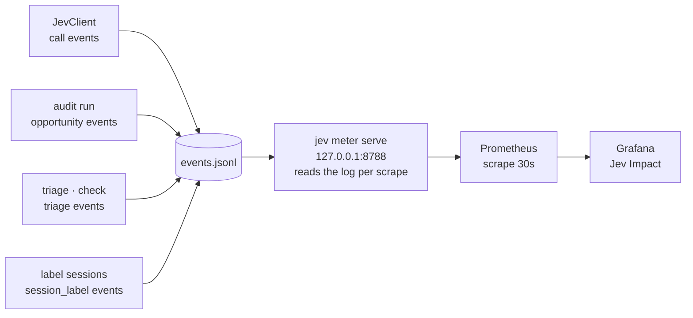

# Metrics and dashboards

The meter turns the local event log into Prometheus series; Grafana renders
them as the `Jev Impact` dashboard on the existing
`~/work/claude-code-metrics` stack.



```console
jev meter serve [--port 8788]     # or JEV_METER_PORT
```

The meter reads `events.jsonl` on each HTTP request and renders the text
exposition format (`text/plain; version=0.0.4`). No state is cached, so a
query always reflects the current log.

## Metric catalogue

| Metric | Labels | Meaning |
|---|---|---|
| `jev_calls_total` | harness, status | Jev API calls (`ok`/`error`) |
| `jev_call_errors_total` | harness, reason | failed calls by typed tag (`JevConfigError`, `JevTransportError`, `JevTimeoutError`, `JevApiError`, `JevDecodeError`; `unknown` = written before tags existed) |
| `jev_tokens_total` | harness, kind | TypeSafe input/output tokens |
| `jev_sessions_with_calls_total` | harness | sessions with at least one Jev call |
| `jev_labeled_sessions_with_calls_total` | harness | labeled sessions that also made at least one Jev call |
| `jev_labeled_sessions_total` | harness | distinct labeled sessions |
| `jev_opportunities_total` | harness, source, matched | detected claims, matched to Jev usage or missed |
| `jev_compliance_ratio` | harness, source | matched / detected claims |
| `jev_triage_total` | feature | triage runs (`failure`/`review`/`commit`) |
| `jev_latency_seconds` | harness, le | call latency histogram |
| `jev_confidence` | primitive, le | confidence histogram for `choice`/`score` answers |
| `jev_noul_probability` | harness, le | p(yes) histogram for `noul` answers, which carry no confidence |
| `jev_sessions_total` | harness, outcome | labeled sessions by outcome |
| `jev_waste_total` | harness, pattern | labeled sessions by dominant waste pattern |
| `jev_session_friction` | harness, le | session friction histogram |
| `jev_session_cost_usd` | harness | agent model cost summed over the latest label of each session |
| `jev_session_tokens_total` | harness, kind | agent tokens (`input`/`output`/`cache_read`/`cache_write`) over labeled sessions |
| `jev_session_tool_errors_total` | harness | harness-reported tool errors over labeled sessions |
| `jev_session_stop_reasons_total` | harness, reason | turn endings (`toolUse`/`stop`/`length`/`error`/`aborted`); the last three mean work stopped early |
| `jev_skill_routes_total` | outcome | skill-routing decisions (`routed`/`none`); decline reasons stay in the log |
| `jev_reviews_total` | harness | `typesafe_review` runs |
| `jev_review_score` | dimension, harness | mean applicable review score (normalized 0–1) |
| `jev_review_direction_total` | harness, direction | before/after directions recorded by reviews with a previous evaluation |
| `jev_log_lines_total` | status | event-log lines by decode status; `skipped` are malformed and ignored |
| `jev_last_event_timestamp_seconds` | — | unix seconds of the newest event (0 when empty) |
| `jev_meter_start_timestamp_seconds` | — | unix seconds the meter process started |

Notes on semantics:

- **Compliance** is `matched / detected` from `opportunity` events written by
  `jev audit run`. Detection is model-first; unmatched claims are those whose
  session questions did not address them (or whose session made no Jev call).
  No harness forwards a session id over MCP, so `jev audit run` recovers the
  link offline: opencode from its message store, pi/omp from the session files
  (`loadPiOmpTurns`), by matching the call's question ids against the assistant
  turn that issued it. A subagent call also credits the session that spawned
  it (`parentSession`), because claims are usually written in the parent.
- **One detection per message.** Each `opportunity` event carries the detected
  message's timestamp (`messageTs`); the meter counts one observation per
  harness, session, source, pattern, and message, keeping the latest verdict.
  Re-auditing an overlapping window therefore refreshes a claim instead of
  adding a second one. Events written before `messageTs` existed use the audit
  run's timestamp, so repeat claims of one pattern in one session collapse into
  one observation.
- **Sessions with calls** counts distinct `sessionID`s on `call` events plus
  every `attribution` event `jev audit run` records when it recovers a link
  from a transcript. That is how pi/omp sessions appear at all: their calls
  carry no id in the log. Coverage and the dashboard's *sessions touched*
  panel both rest on this count.
- **Session facts** (cost, tokens, tool errors, stop reasons) ride on the
  `session_label` event, so they cover labeled sessions only; a session that
  was never labeled contributes to no fact series. Facts follow the latest
  label, so re-labeling a session replaces its numbers.
- **Detection reads assistant prose only.** Claims written inside tool calls
  (a report a subagent `write`s, for example) are not extracted, so subagent
  sessions that never emit prose contribute no opportunities.

- **Skill routing** counts decisions, not tasks: one `route` event per call, with the
  chosen skill name in the log and only the outcome in labels, so a new skill never
  creates a new series.
- **Coverage** pairs labeled sessions with calls:
  `jev_labeled_sessions_with_calls_total / jev_labeled_sessions_total`, both
  distinct-session counts (re-labeling a session does not inflate the ratio).
- **Outcome, waste, and friction** keep one observation per labeled session:
  when a session is labeled again, its latest label wins. Labels without a
  `sessionID` cannot be deduped and count per event.
- **Confidence** is recorded per answer, so a single call contributes several
  observations. `noul` answers carry no confidence field, so they feed
  `jev_noul_probability` with their p(yes) value instead.
- **Harness tags** accept the pre-rename `opencode2` tag from the log and
  normalize it to `opencode`, so series stay continuous across commit 8030103.
- Histograms use `le` buckets and expose `_bucket`/`_sum`/`_count` series.

Example queries:

```promql
sum by (harness) (rate(jev_calls_total[1h]))
jev_compliance_ratio
sum by (outcome) (jev_sessions_total)
histogram_quantile(0.9, sum by (le) (rate(jev_latency_seconds_bucket[1h])))
sum by (harness) (jev_session_cost_usd)
sum by (reason) (increase(jev_session_stop_reasons_total[1d]))
time() - jev_meter_start_timestamp_seconds        # stale meter detector
```

The compliance stat on the dashboard uses the selected time range, not the
all-time counter: historical `opportunity` events written before attribution
worked would otherwise hold the ratio near zero forever.

## Dashboard

`dashboards/jev-impact.json` is the canonical dashboard. Install or refresh it
into the metrics stack (idempotent; never rewrites an existing scrape job):

```console
scripts/install-dashboard.sh            # JEV_METRICS_STACK to override the stack path
(cd ~/work/claude-code-metrics && podman-compose restart grafana)
```

Dashboard: <http://localhost:3000/d/jev-impact>.

It ends with a **Meter health** row: log lines skipped (must stay 0), meter age
(older than the last code change means the process serves stale code), and log
freshness (growing means nothing writes the log).

## Always-on meter (launchd)

`launchd/com.jev.meter.plist` runs `jev meter serve` under launchd
(`RunAtLoad`, `KeepAlive`) with logs at `~/.local/share/jev/meter.log`:

```console
launchctl bootstrap gui/$UID ~/personal/jev-toolkit/launchd/com.jev.meter.plist
launchctl bootout gui/$UID/com.jev.meter      # stop
```

## Nightly refresh (launchd)

`launchd/com.jev.nightly.plist` runs `scripts/nightly.sh` at 04:30: label 24h
of sessions, audit 24h of claims, then run `scripts/check-metrics.sh` and log
the result to `~/.local/share/jev/nightly.log`.

```console
launchctl bootstrap gui/$UID ~/personal/jev-toolkit/launchd/com.jev.nightly.plist
launchctl bootout gui/$UID/com.jev.nightly    # stop
```

launchd starts with a bare environment, so the script resolves the API key in
this order: the launchd session (`launchctl setenv TYPESAFE_API_KEY ...`), a
`~/.config/jev/env` file with `TYPESAFE_API_KEY=...` (chmod 600), then the
user's own interactive zsh. Without a key it logs a skip and exits 0. It also
resolves `node` itself, since launchd's PATH omits Homebrew.


After meter-code edits, restart it so the new code is loaded.

## Smoke test

`scripts/check-metrics.sh` queries Prometheus for every `jev_*` metric family
and fails if a series is missing:

```console
scripts/check-metrics.sh         # PROM_URL to override http://localhost:9090
```

Run it after installs, after meter restarts, and after audit changes that
should produce new series.
