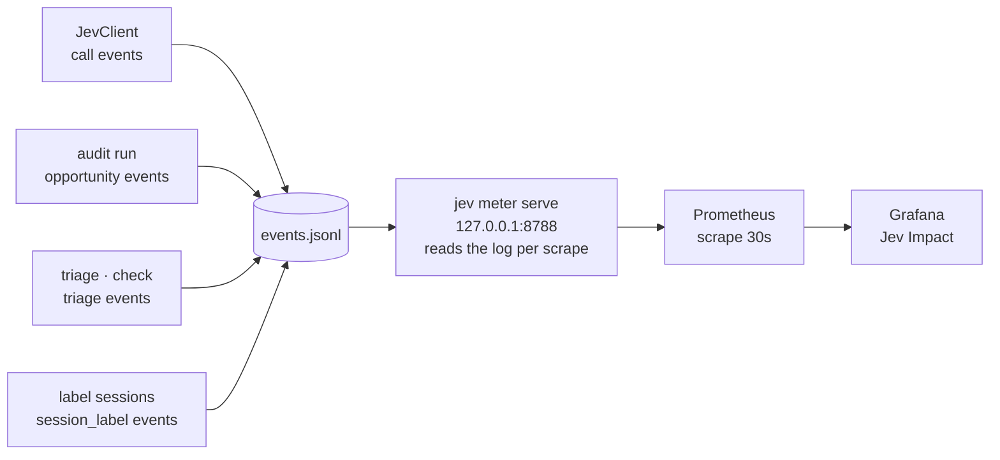

# Metrics and dashboards

The meter turns the local event log into Prometheus series; Grafana renders
them as the `Jev Impact` dashboard on the existing
`~/work/claude-code-metrics` stack.



```console
jev meter serve [--port 8788]     # or JEV_METER_PORT
```

The meter reads `events.jsonl` on each HTTP request and renders the text
exposition format (`text/plain; version=0.0.4`). No state is cached, so a
query always reflects the current log.

## Metric catalogue

| Metric | Labels | Meaning |
|---|---|---|
| `jev_calls_total` | harness, status | Jev API calls (`ok`/`error`) |
| `jev_tokens_total` | harness, kind | TypeSafe input/output tokens |
| `jev_sessions_with_calls_total` | harness | sessions with at least one Jev call |
| `jev_labeled_sessions_with_calls_total` | harness | labeled sessions that also made at least one Jev call |
| `jev_labeled_sessions_total` | harness | distinct labeled sessions |
| `jev_opportunities_total` | harness, matched | detected claims, matched to Jev usage or missed |
| `jev_compliance_ratio` | harness | matched / detected claims |
| `jev_triage_total` | feature | triage runs (`failure`/`review`/`commit`) |
| `jev_latency_seconds` | harness, le | call latency histogram |
| `jev_confidence` | primitive, le | answer confidence histogram (`choice`/`noul`/`score`) |
| `jev_sessions_total` | harness, outcome | labeled sessions by outcome |
| `jev_waste_total` | harness, pattern | labeled sessions by dominant waste pattern |
| `jev_session_friction` | harness, le | session friction histogram |

Notes on semantics:

- **Compliance** is `matched / detected` from `opportunity` events written by
  `jev audit run`. Detection is model-first; unmatched claims are those whose
  session questions did not address them (or whose session made no Jev call).
  Alignment needs `call` events that carry a `sessionID`; `typesafe_ask` takes
  an optional `sessionID` and the calling agent must pass the id its harness
  provides. `jev audit run` infers the session for unattributed OpenCode2 calls
  when the transcript allows it; other calls without an id cannot be matched.
- **Sessions with calls** counts distinct `sessionID`s on `call` events —
  a session without a `sessionID` (some MCP clients) cannot be counted.
- **Coverage** pairs labeled sessions with calls:
  `jev_labeled_sessions_with_calls_total / jev_labeled_sessions_total`, both
  distinct-session counts (re-labeling a session does not inflate the ratio).
- **Outcome, waste, and friction** keep one observation per labeled session:
  when a session is labeled again, its latest label wins. Labels without a
  `sessionID` cannot be deduped and count per event.
- **Confidence** is recorded per answer, so a single call contributes several
  observations.
- Histograms use `le` buckets and expose `_bucket`/`_sum`/`_count` series.

Example queries:

```promql
sum by (harness) (rate(jev_calls_total[1h]))
jev_compliance_ratio
sum by (outcome) (jev_sessions_total)
histogram_quantile(0.9, sum by (le) (rate(jev_latency_seconds_bucket[1h])))
```

## Dashboard

`dashboards/jev-impact.json` is the canonical dashboard. Install or refresh it
into the metrics stack (idempotent; never rewrites an existing scrape job):

```console
scripts/install-dashboard.sh            # JEV_METRICS_STACK to override the stack path
(cd ~/work/claude-code-metrics && podman-compose restart grafana)
```

Dashboard: <http://localhost:3000/d/jev-impact>.

## Always-on meter (launchd)

`launchd/com.jev.meter.plist` runs `jev meter serve` under launchd
(`RunAtLoad`, `KeepAlive`) with logs at `~/.local/share/jev/meter.log`:

```console
launchctl bootstrap gui/$UID ~/personal/jev-toolkit/launchd/com.jev.meter.plist
launchctl bootout gui/$UID/com.jev.meter      # stop
```

After meter-code edits, restart it so the new code is loaded.

## Smoke test

`scripts/check-metrics.sh` queries Prometheus for every `jev_*` metric family
and fails if a series is missing:

```console
scripts/check-metrics.sh         # PROM_URL to override http://localhost:9090
```

Run it after installs, after meter restarts, and after audit changes that
should produce new series.
